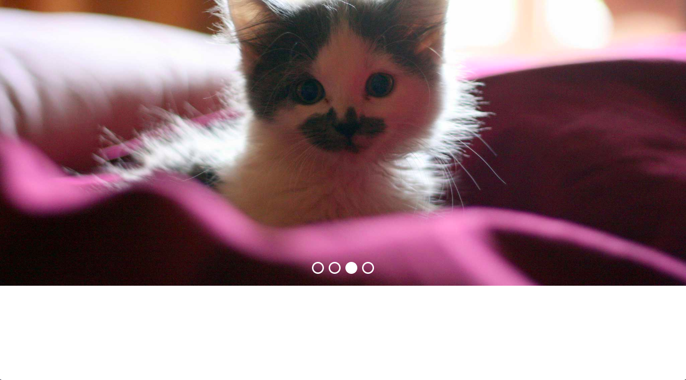

# Image Carousel

"Image Carousel" aka "Kitty Carousel" was a small JavaScript project done at my stint at [SPICED Academy](https://www.spiced.academy/program/full-stack-web-development/). While probably a thing to be avoided the project was still a nice learning opportunity.

---

## Preview

## Demo

https://videothrone.github.io/img-carousel/

## Tech

HTML, CSS, JavaScript

## Features

-   Four cat images rotate through carousel with a `setTimeout` of five seconds

-   Users can click on dots to jump ahead or back, after the click the rotation is picked up again

## Goals while doing the project

-   Learn usage of `clearTimeout` and `setTimeout`

-   Build JS logic for carousel, add / remove classes / work with event handlers etc.
